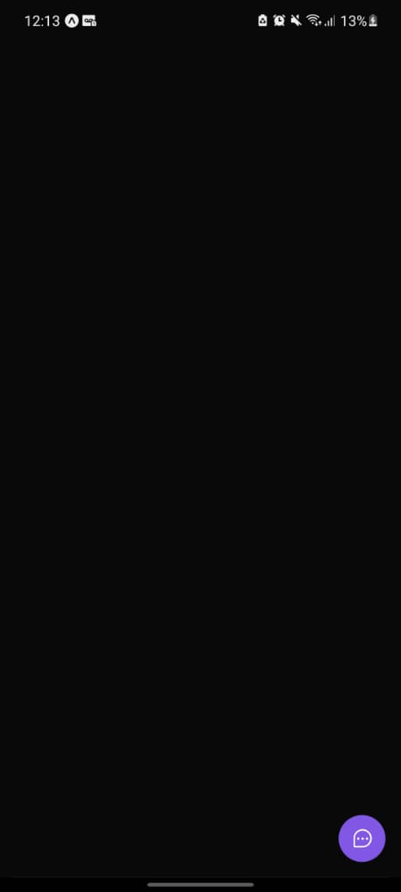
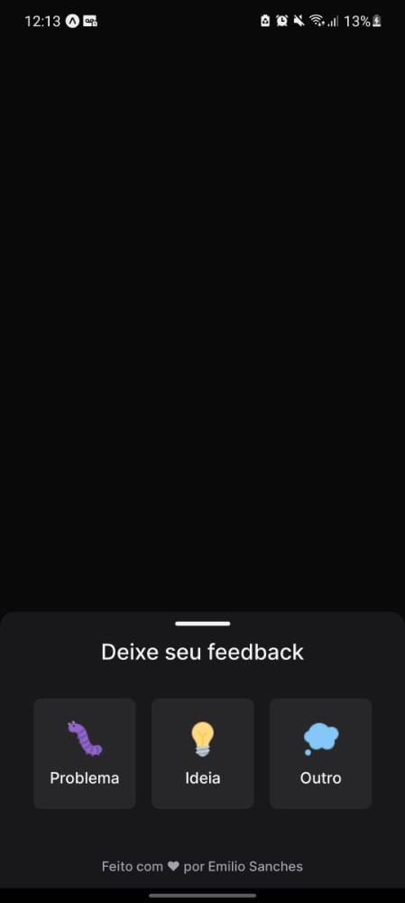
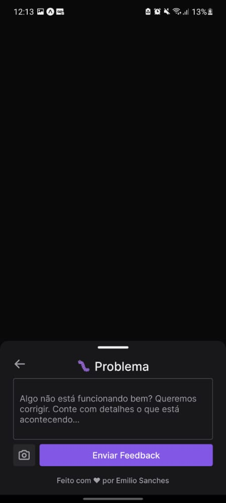
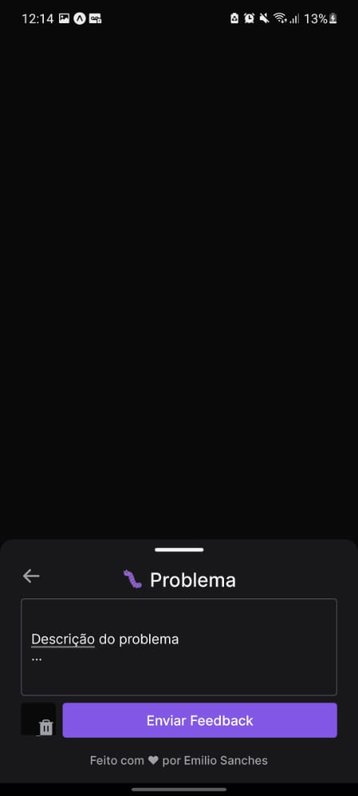
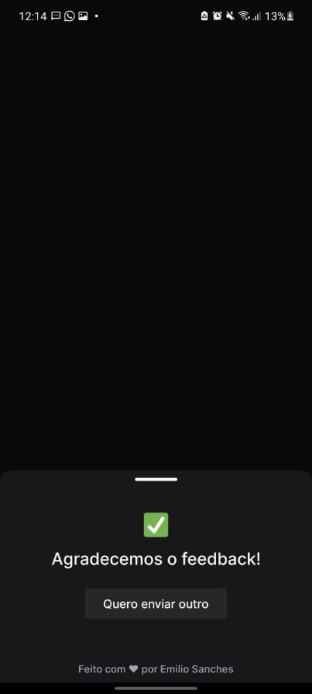

# Feedget - Widget de coleta e armazenamento de feedbacks 

Esse sistema foi desenvolvido durante a oitava edição do evento Next Level Week, realizado pela [Rocketseat](https://www.rocketseat.com.br).

O sistema consiste em uma [aplicação web](https://github.com/emiliosanches/nlw8-feedback-widget-web), um [servidor HTTP](https://github.com/emiliosanches/nlw8-feedback-widget-server) e um [aplicativo mobile](https://github.com/emiliosanches/nlw8-feedback-widget-mobile) que se comunicam via HTTP utilizando JSON como formato de dados. Além de um banco de dados relacional PostgreSQL.  
 

#### 🔧 Features
* Seleção de tipo de feedback entre "Problema", "Ideia" ou "Outro"
* Inserção de captura de tela da página atual
* Armazenamento de feedbacks recebidos em banco de dados
* Redirecionamento de feedbacks para endereço de e-mail do administrador da aplicação

#### 💡 Melhorias futuras (implementadas após o evento)
* **Web (front end)**:
  - [ ] Seleção de tema light/dark
  - [ ] Dashboard de feedbacks recebidos:
    - [ ] Tela de login
    - [ ] Tela de listagem de feedbacks

* **Server (back end)**
  - [ ] Melhorar o corpo HTML do e-mail de feedback
  - [ ] Validação de requests e tratamento de exeções
  - [ ] Dashboard de feedbacks recebidos:
    - [ ] Autenticação
    - [ ] Endpoint autorizado de listagem de feedbacks

* **Mobile App**
  - [ ] Seleção de tema light/dark
  - [ ] Adição de spash screen

## 📱 Mobile App (Android/iOS)

#### 🖥️ Preview (fluxo do usuário)

 

 

 

#### 👨‍💻 Tecnologias e bibliotecas
* [ReactNative](https://reactnative.dev) para construção da aplicação multi-plataforma
* [Expo](https://expo.dev) para acesso às APIs nativas de forma mais simples
* [Axios](https://axios-http.com/ptbr/) para comunicação com o servidor HTTP
* Diversas bibliotecas para funções específicas, como [React Native Bottom Sheet](https://gorhom.github.io/react-native-bottom-sheet/), [Expo Font](https://docs.expo.dev/guides/using-custom-fonts/), [React Native Gesture Handler](https://docs.expo.dev/versions/latest/sdk/gesture-handler/), entre outras (vide `package.json`)
 

#### 🎨 Design
O protótipo do layout dessa aplicação foi feito pelo figma e pode ser encontrado [clicando aqui](https://www.figma.com/file/nez4KO3krc7bFt6vTldiaE/Feedback-Widget-(Community)?node-id=10%3A1638).
 

#### 🚀 Executando o projeto
* `git clone https://github.com/emiliosanches/nlw8-feedback-widget-mobile`
* `cd nlw8-feedback-widget-mobile`
* `yarn` ou `npm install`
* `yarn start` ou `npm start` para iniciar o expo
  a. Caso queira rodar em um emulador Android/Simulator iOS, pressione d no terminal para abrir a interface do Expo no seu navegador e depois clique em "Run on Android emulator" ou "Run on iOS simulator"
  b. Caso queira rodar no seu smartphone físico:
    - Instale o Expo pela loja de aplicativos (Google Play Store ou Apple App Store)
    - Abra o Expo no seu smartphone e clique em "Scan QR code"
    - Escaneie o código QR exibido no terminal ou na interface do Expo no navegador (pressione "d" no terminal para abrí-la)
 

#### 🔗 Repositórios relacionados
* [Server (back-end)](https://github.com/emiliosanches/nlw8-feedback-widget-server)
* [Web (front end)](https://github.com/emiliosanches/nlw8-feedback-widget-web)
